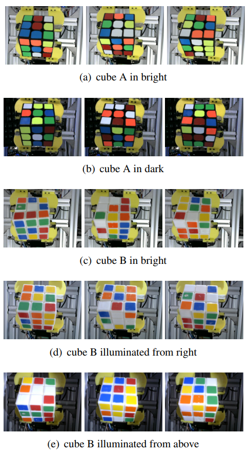

# Rubick-s-Cube-Dataset
The Rubick-s-Cube-Dataset is origin from the paper "COLOR RECOGNITION FOR RUBIK’S CUBE ROBOT"
https://arxiv.org/pdf/1901.03470.pdf

## Description
The entire dataset consists of 348 images with the same resolution (640 × 480), a total of 18792 color block information. The dataset contains the following 5 circumstances: cube A in bright, cube A in dark, cube B in bright, cube B illuminated from right, cube B illuminated from above. A and B are cubes with two different backgrounds.

In addition, The meaning of labels are shown in Table. 

| number | label  |
| ------ | ------ |
| 0      | green  |
| 1      | white  |
| 2      | yellow |
| 3      | red    |
| 4      | orange |
| 5      | blue   |
|        |        |

